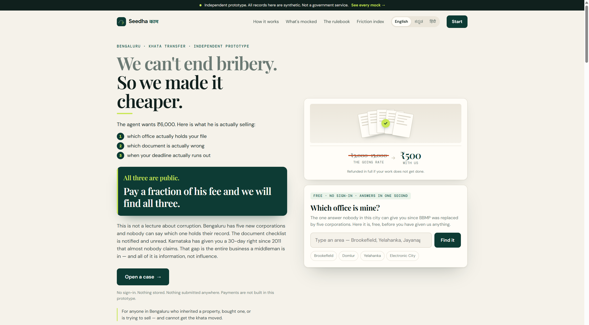

# Seedha काम

> **Showcase repository — [Build What Moves India](https://buildwhatmovesindia.com/)**
>
> Independent prototype for Bengaluru khata transfer pre-flight: jurisdiction
> resolution, deterministic document checks, statutory clock, and appeal drafting.
> **Synthetic data only. Not a government service.**

| | |
|---|---|
| **Live demo** | [seedha-kaam.vercel.app](https://seedha-kaam.vercel.app) |
| **Repository** | [github.com/aayusharmaaa/seedha-kaam](https://github.com/aayusharmaaa/seedha-kaam) |
| **Submission pack** | [`SUBMISSION.md`](SUBMISSION.md) — summary, demo script, reviewer checklist |



**Khata transfer without a middleman.** *Sarkari kaam, seedha.*

> **We can't end bribery. So we made it cheaper.**
>
> The ₹6,000 an agent wants is mostly not a bribe — it is the price of three
> things nobody told you: which office holds your file, which document is
> actually wrong, and when your deadline runs out. All three are public.

An independent prototype for one Bengaluru problem: transferring a property khata
after an inheritance or a purchase, without paying somebody ₹3,000–₹15,000 to be
told your papers are "not in order."

> **This is not a government service.** Every property record in it is synthetic.
> Nothing is submitted anywhere. No government portal password is ever asked for,
> stored or used. No government logo appears anywhere in it.
> Full disclosure at [`/mocks`](#the-mock-register).

---

## The problem

Forty per cent of bribes paid in India are for property registration and land —
the largest single category. But the number that matters is the next one:
**38% of people who paid say it was the only way to get their work done**, and
54% of businesses report being *forced* to pay.

Most of that money is not buying an unfair advantage. It is buying a service the
state already owes you. That is not a moral problem to be shamed away. It is a
friction problem, and friction can be engineered away.

Bengaluru sharpens it: BBMP was replaced by five city corporations, so for a lot
of addresses nobody can reliably say which office even holds their file.
Confusion is the raw material of extraction.

**Five things are hard today**, and none of them is "the website looks bad":

1. You do not know which office is yours.
2. You do not know whether your documents will be accepted.
3. "Documents not in order" is unfalsifiable to you, which is what makes it the
   perfect lever.
4. There is no clock. No consequence attaches to a file sitting on a desk.
5. An escalation right exists and is unusable, because knowing which officer,
   which format and which deadline is itself the expertise being sold.

An agent absorbs 1 through 5. This does 1 through 5 with software.

---

## What it does

| | |
|---|---|
| **Jurisdiction resolver** | Point-in-polygon over the five corporation boundaries. Within 1.5 km of a divide it returns **both** offices and which to try first, rather than a confident guess. Given away free in the hero, before you have entered anything. |
| **Compliance pre-flight** | 46 deterministic rules compare names, survey numbers, property IDs, tax-year continuity, dates, stamp duty and encumbrances across every document. Each finding names the rule, the two documents that disagreed and the exact field. |
| **Guided packet** | Cover sheet, enclosures in order, counter checklist, full evidence report — generated as PDFs you file yourself. |
| **The clock** | Your acknowledgement number attaches the statutory deadline. On breach the first appeal is drafted with correct date arithmetic; later, the second appeal and an RTI for the file's movement history. You write nothing. |
| **Three languages, spoken** | Kannada, Hindi and English. Every defect explanation can be read aloud. Voice intake accepts code-mixed speech — "naanu appa house-na khata transfer maadbeku" — with cue matching that never has to pick a language first. |
| **Friction index** | Every completed case leaves one anonymous row: office, service, days taken. By office, **never by officer**. |

---

## Recent improvements

These were not missing features. They were places the product was already
claiming more than it delivered. Fixing that is the interesting work.

### The engine runs on your phone

→ [How it works](#the-engine-runs-on-the-device) · [`src/engine.js`](src/engine.js) · [commit](https://github.com/aayusharmaaa/seedha-kaam/commit/636165e)

The rule pack never needed a server — no filesystem, no network, no Node
builtins. We were still shipping documents off the phone to check them.

Now the same modules load in the browser. A full check runs with the network
cut: same verdict, same defect codes. About 31 KB gzipped, imported statically
on purpose — lazy-loading it would break the one moment it exists for: no
signal.

### We stopped asking a model to judge blur

→ [How it works](#physical-quality-is-measured-not-judged) · [`src/measure.js`](src/measure.js) · [commit](https://github.com/aayusharmaaa/seedha-kaam/commit/636165e)

Three format rules need physical quality. `FMT-05` wants a legibility score
below 0.6. Nothing produced that number, so the vision model was asked to
*decide* if a scan was readable. That was the one place a model opinion could
move a verdict — while the README said the opposite.

Pixels do the work now: Laplacian variance, face detection, border deviation,
ink density. The rule pack did not change. In the browser, a 4px blur scores
0.111 and fails; 1.5px scores 0.674 and passes.

### An Ask button that cannot invent answers

→ [How it works](#the-assistant-retrieves-it-does-not-compose) · [`src/assistant.js`](src/assistant.js) · [commit](https://github.com/aayusharmaaa/seedha-kaam/commit/7b00ca0)

The orb opens a small panel — type or speak, in Kannada, Hindi, or English.
Every reply is pulled from the ledger, the engine, the office resolver, or the
clock. Nothing is generated. A test strips every known fragment out of each
answer and checks that **no word is left**.

Building it found five bugs of its own. Four were Indic: `\p{L}` skips
combining marks, so `ಕಂದಾಯ` broke at every matra. Matching worked in English
and failed in the two languages this product is for.

### The packet was lying about order — and about what you had

→ [`server/pdf.js`](server/pdf.js) · [commit](https://github.com/aayusharmaaa/seedha-kaam/commit/d2e02c8)

Enclosures printed in whatever order you uploaded them, under a heading that
said *assemble in this order*. That order meant nothing. Worse:
`missingRequired` already lived in the evaluation and never reached the PDF —
so someone three certificates short got a stack that looked finished.

Now: a real filing order, a **NOT IN THIS STACK** block, PID / khata / survey
on the cover, tick boxes, a declaration, page numbers. These pages get pulled
apart at a counter; they have to survive that.

### Sakala was in the code and missing from the paper

→ [`server/engine/clock.js`](server/engine/clock.js) · [commit](https://github.com/aayusharmaaa/seedha-kaam/commit/e53b220)

`clock.js` already knew the numbers — **30 calendar days** under Sakala, who
answers, the three-rung appeal ladder — all marked verified. Neither PDF
printed them. The packet even left a blank for “days allowed,” as if you learn
that at the counter.

You don’t. That period *is* the leverage. It now sits on both documents. The
packet gets handed over at the counter, so putting the entitlement only there
would mean giving away the page that says what the office owes you.

### Back used to throw you out of the case

→ [`src/Journey.jsx`](src/Journey.jsx) · [commit](https://github.com/aayusharmaaa/seedha-kaam/commit/e71dd52)

All eight steps shared one URL. On a phone, Back is how you navigate — and at
step six it left the case entirely.

Fixing that turned up two more traps: a “canonical” redirect that *pushed*
history and bounced you forward onto step one, and a reload of a deep step that
sent you to start because a child effect ran before its parent. Steps now live
in the URL (`#/case/check`, and so on). A case with a clock resumes on the
clock step — the one journey that spans days was the one restarting from
scratch.

---

## The architectural commitment

```
   MODEL            PIXELS              YOU              ENGINE             LEDGER
reads a photo  +  measured on   →  confirm every  →  decides,        →  turns the code
into fields       the device       value             deterministically   into your language
(transcribes,     (legibility,                       (46 rules,          (47 codes ×
 never judges)     face, ink)                         in your browser)     3 languages)
```

**Rules decide. The model only reads and explains.**

A hallucinated "your papers are fine" costs someone a day of work, a bus fare and
the only leverage they had. So the model is never in the decision path. It
transcribes pixels into candidate field values, every one of which is shown to
the citizen as an editable field before a single rule runs. The verdict itself
comes from a versioned rule pack, and every verdict carries a **"why this answer"**
expander showing the rule id, the documents that disagreed, the exact field, and
the source of the requirement — including when that source is marked *not traced
to a published clause*, which twelve of the forty-seven are. Two of those twelve
are **blocking**, which is the uncomfortable case: the product tells you that you
will be turned away on a ground it cannot cite, and says so in those words.

**Credentials are never the mechanism.** There is no field anywhere in this
product for a government portal password or OTP, and no code path that would
accept one. The citizen submits; we prepare and track. A product built on
credential automation or screen-scraping a government portal cannot survive its
own scale, and we are deliberately not making that mistake.

### The engine runs on the device

The rule pack is not behind an API. It is imported into the client bundle and
evaluated in the browser (`src/engine.js`), because its entire dependency
closure —

```
compliance.js → ledger.js
              → khata-transfer.v1.js → text.js
```

— has no file system, no network and no node builtins in it. It never needed a
server; it was written on one first.

|  | before | now |
| --- | --- | --- |
| No signal | the check could not run | the check runs |
| Documents | uploaded to be checked | never leave the phone |
| Re-check after a fix | a round trip | sub-millisecond |

This costs about **31 KB gzipped** and it is a deliberately *static* import. The
obvious optimisation — split it into a chunk fetched when the citizen reaches
the check step — destroys the feature, because a chunk fetched on demand cannot
be fetched when there is no signal, which is the exact moment this exists for.

The server still re-runs the same evaluation before it will attach a statutory
clock to a case. Putting the engine on the device makes the check fast and
private; it does not make the browser the authority.

### The assistant retrieves; it does not compose

A conversational box sitting next to a verdict is the most dangerous place in
this product for a language model. Everything here rests on *rules decide, the
model only reads and explains* — and a bot that answers **"so am I okay?"** in
its own words walks straight through that, in the one place where a reassuring
hallucination costs somebody a wasted trip and the only leverage they had.

So the assistant splits the loop in half:

| | who does it |
| --- | --- |
| Understanding the **question** | a model, eventually — this is what models are good at |
| Composing the **answer** | never a model. The ledger, the engine, the resolver, the clock |

Someone says *"idu sari illa antha helidru, ee tax receipt yenu maadbeku?"* —
code-mixed, half-Kannada, pointing at "this" without naming it. Turning that
into *"asking for the fix for TAX-01"* is genuinely hard. Reading the answer out
of `explain('TAX-01', 'kn')` is not, and it returns a sentence a person wrote
with a citation attached. **Model on the way in, ledger on the way out.**

This is the same shape as `intake.js`, where a model interprets a spoken
sentence and deterministic code decides what it means. Not a new architecture —
the existing one, used twice.

Today `matchIntent` is pure keyword matching with no model at all, so the
assistant works offline beside the engine. That is a floor, not a stub: whatever
is added above it has to keep working with no signal.

Two properties fall out of the split, and both are load-bearing:

- **It cannot hallucinate a verdict.** A test strips every fragment traceable to
  the ledger, the engine or the UI scaffolding from each answer and asserts that
  no *word* survives. Punctuation and digits may; a letter would be a claim
  about someone's case that nobody wrote.
- **Cost stays flat in population.** Answers are free because they already
  exist. A generative answer layer would have been the one per-citizen model
  cost in the product, and unbounded.

When it does not understand, it says so and offers what it does know. It never
guesses.

### Physical quality is measured, not judged

Three rules — `FMT-03`, `FMT-05`, `FMT-06` — read the physical quality of an
upload rather than anything written on it. They were always shaped correctly:

```js
f(d, 'legibility') < 0.6        // a number and a threshold
```

What was missing was anything that produced the number, so the vision model was
asked for it: *"legibility: number between 0 and 1 describing how readable the
scan is"*. That is not transcription, it is a judgement — and it was the one
place in the product where a model's opinion reached a rule and moved a verdict.

`src/measure.js` closes it with arithmetic over pixels, on the citizen's device,
before anything is uploaded. **The rule pack did not change at all.**

| Field | How it is measured now |
| --- | --- |
| `legibility` | variance of the Laplacian, at a fixed 1000px working width |
| `widthPx` | the image's intrinsic width |
| `faceVisible` | the browser's `FaceDetector`, where it exists |
| `plainBackground` | standard deviation of the border band |
| `signaturePresent` | dark-pixel density in the lower fifth of the page |

The measured values are stripped from the extraction and written in by the
upload route, so a model that volunteers a legibility score anyway cannot race
the measurement and win.

**Every one of these is a heuristic, and the design rule is reticence.** A
measure that is confident when it should not be sends someone to a notary, or a
photo studio, for nothing. So each returns `undefined` when the pixels are
ambiguous — a printed footer is not distinguishable from a signature, an absent
`FaceDetector` is not evidence of a missing face — and `undefined` is not a
value any rule fires on. Not knowing produces silence, which is correct.

The calibration is honest guesswork from the shape of the measure, not values
fitted to a corpus of real Bengaluru khata scans. Tuning them against such a
corpus is the highest-value work available on that file, and until it happens
`FMT-05` is a strong hint rather than a verdict.

---

## Why cost is flat in population

Explanations are cached per **(defect code × language)** — 47 × 3 = **141
explanations that exist in total, forever**, no matter how many citizens use it.
There is no per-citizen generation anywhere in the verdict path. Marginal cost
per citizen is one deterministic engine call plus, optionally, one extraction.

Serving one crore people costs the same model spend as serving ten thousand.

Adding a service means **authoring a rule file**, not writing a scraper. A rule
pack declares its required documents, its consistency constraints, its statutory
period and its escalation ladder. EPF claims, caste certificates and trade
licences fit the same shape.

---

## Run it

```bash
npm install
npm run dev
```

Open `http://localhost:5173`. The client proxies `/api` to the server on 3001.

```bash
npm test          # 85 engine tests: golden corpus + injected-defect corpus + ledger integrity
node scripts/smoke.mjs   # boots the server and walks the entire citizen journey over HTTP
npm run check     # both, plus a production build
```

Production:

```bash
npm run build && npm start        # serves dist + API on PORT (default 3001)
docker build -t seedha-kaam . && docker run -p 3001:3001 seedha-kaam
```

`render.yaml` is included for a one-click Render deploy. The live Vercel deployment
at [seedha-kaam.vercel.app](https://seedha-kaam.vercel.app) opens with no sign-in
and no credentials — there is nothing to log into.

### API keys on this deployment

`OPENAI_API_KEY` and `OPENAI_MODEL` are set as **encrypted Vercel environment
variables** on production. They are never committed to this repository. `/api/meta`
reports the live extraction mode (`openai-vision` when the key is present).

| Variable | Status | Notes |
|---|---|---|
| `OPENAI_API_KEY` | **Set on Vercel** (encrypted) | Vision reads uploads into candidate fields; citizen still confirms every value |
| `OPENAI_MODEL` | **`gpt-4o-mini`** on Vercel | Override locally or in the Vercel dashboard |
| Without a key | Manual path | File-name classification + citizen-typed fields; **identical** compliance engine; pixel measurement never used the model |

To run vision locally, copy `.env.example` to `.env` and set `OPENAI_API_KEY`.
The UI always states which extraction path ran. The model never decides
compliance — it only proposes field values for you to confirm.

### Vision extraction

With `OPENAI_API_KEY` set, uploaded photographs are read into candidate field
values by an OpenAI vision model. **With no key the product still works end to
end**: documents are classified by file name and the citizen confirms the fields
themselves. The compliance engine is byte-identical either way.

The manual path is not a degraded fallback. On a 2G connection, typing six
fields beats uploading a 3 MB photo, and it is the path that works in a CSC
kiosk with no connectivity budget.

---

## What works, and what is mocked

**Fully working:** the jurisdiction resolver including the contested-boundary
path; the 46-rule compliance engine with its full evidence trail; the 47-code
defect ledger in three languages; readiness scoring and the re-check loop;
transliteration-aware name matching across Kannada, Devanagari and Latin; the
Verhoeff checksum on Aadhaar-format numbers; code-mixed intake; PDF packet,
readiness report, first appeal, second appeal and RTI generation; the statutory
clock with breach detection and staged escalation availability; the friction
index; browser speech in and out; immediate case deletion; **an assistant that answers only out of the rulebook**; **the compliance
engine running in the browser**, so a full check — not merely re-reading an old
one — works with no network at all and without uploading the documents;
**pixel-measured legibility, photo and signature checks** replacing what the
vision model used to be asked to judge.

**Mocked or absent:** every property record is synthetic; nothing is submitted to
any office; there is no payment flow at all; corporation boundaries are
approximate hand-drawn envelopes rather than official geometry; appeals and RTIs
are drafted and downloadable but never delivered; the time-travel control is a
labelled demo affordance; the friction index is seeded with 15 synthetic rows.

**Limitations we state before anyone asks:** compliance rules encode publicly
notified requirements, and individual offices apply discretion — the pre-flight
reduces rejection risk rather than eliminating it, and the product says so in
those words. Boundary geometry is approximate, so contested cases return two
offices rather than a confident guess. Statutory quanta drift, so every one is
stamped with a verification date and three ledger entries are explicitly marked
*not traced to a published clause*. One service, one city — generalisation is
claimed as a design property, not a demonstrated one.

### The mock register

`/mocks` in the app (and `GET /api/mocks`) lists **fourteen** entries, each with
what the prototype does instead, what is genuinely real, and what would replace
it in production. If you find something not on that list, that is a bug in the
list.

---

## Future scope

Everything below is **out of scope for this showcase** but already shaped in the
architecture, the mock register (`#/register`), or the rule-pack design. The
prototype is built so these are extensions, not rewrites.

### Near term (production hardening)

| Area | Today | Future |
|---|---|---|
| **Case persistence** | In-memory, 3-hour TTL; lost on serverless cold start unless browser snapshot is sent | Durable store with explicit consent, retention policy aligned to DPDP Act principles, and immediate delete |
| **Vision extraction** | OpenAI vision when `OPENAI_API_KEY` is set; manual confirm otherwise | On-device downscaling; stronger pre-processing for face/signature regions |
| **Corporation boundaries** | Hand-drawn approximate envelopes | Official machine-readable GBA/corporation boundary files — geometry code stays the same |
| **Address geocoding** | Offline gazetteer of 61 localities | Consent-based geocoder with offline fallback for poor connectivity |
| **Serverless deploy** | Vercel + browser case snapshot workaround | Shared session store (e.g. Vercel KV / Redis) for cross-instance case continuity and PDF generation |
| **Service worker cache** | PWA shell + stale-while-revalidate for GET APIs | Versioned cache busting on every deploy; network-first for all mutating flows |

### Product (citizen-facing)

| Area | Today | Future |
|---|---|---|
| **Payments** | No payment screen | Payment gateway, receipt, refund path tied to the “refunded if work not done” guarantee |
| **Submission** | Citizen files the packet themselves | Stays citizen-submitted; no portal credential storage or screen-scraping |
| **Appeals & RTI** | Drafted and downloadable PDFs | Optional filing integration with official grievance channels, on explicit citizen instruction each time |
| **Government data access** | Citizen uploads own documents | Consent-based civic data transport (account-aggregator model for property records, when it exists) |
| **Aadhaar** | Format/checksum validation only | eKYC at the counter between citizen and office — we never store Aadhaar |
| **Voice** | Browser Web Speech API | Pre-rendered audio per defect code × language (~135 clips), cached once for all users |
| **Friction index** | 15 seeded rows + anonymous deployment rows | Published minimum-case threshold per office; open data feed; never by officer |

### Scale (more services, more cities)

| Area | Today | Future |
|---|---|---|
| **Services** | Khata transfer, Bengaluru, one rule pack (`khata-transfer@1.4.0`) | Additional rule packs: EPF claims, caste certificates, trade licences — same engine shape, new YAML/JS rule files |
| **Cities** | Five Bengaluru corporations | Additional city boundary packs + gazetteers; same jurisdiction resolver |
| **Document vault** | Per-case documents only | Confirm-once vault: Aadhaar, address proof, photo reused across later services |
| **Statutory catalogue** | Encoded SLAs with verification dates | Maintained service catalogue with “cannot verify — see official source” fail-safe |
| **Languages** | English, Kannada, Hindi (141 ledger explanations) | More languages by extending the ledger, not regenerating per citizen |
| **Intake** | Deterministic cue matching + optional model gap-fill | Same cue-first design; model only fills blanks when key is present |

### Explicit non-goals (by design)

- Storing or using government portal passwords or OTPs
- Submitting applications on a citizen’s behalf without their action
- Screen-scraping government portals
- Naming individual officers in the friction index
- Claiming official government endorsement

Full disclosure for all fourteen mocked areas: open **`#/register`** in the live
app or `GET /api/mocks`.

---

## Repository map

```
server/
  engine/text.js         transliteration, phonetic matching, identifier normalisation
  engine/ledger.js       47 defect codes × 3 languages, each with a cited source
  engine/compliance.js   the deterministic evaluator
  engine/clock.js        statutory periods, breach detection, escalation ladder
  rules/khata-transfer.v1.js   the rule pack — 46 rules, pure predicates
  geo/jurisdiction.js    corporation polygons, gazetteer, contested-boundary logic
  extract.js             vision extraction + the manual-confirm path
  intake.js              code-mixed cue matching
  pdf.js                 packet, report, appeals, RTI
  mocks.js               the mock register
  store.js               in-memory cases with a TTL + the anonymised friction index
src/
  engine.js              the same rule pack above, imported and run in the browser
  assistant.js           the assistant's answers — retrieved from the ledger, never written
  Assistant.jsx          the orb, the panel, voice in and out
  measure.js             Laplacian blur, face, background and ink measurement
  Journey.jsx            the eight-step flow; the step lives in the URL
  ...                    landing, /mocks, /rulebook, /index, i18n, speech
public/sw.js             precaches the bundle, because the bundle is the engine
test/engine.test.js      the CI gate — rules, ledger, PDFs, measurement
scripts/smoke.mjs        end-to-end journey over HTTP
```

Note that `src/engine.js` and `src/measure.js` sit on opposite sides of the same
commitment. The engine is the part that decides and it is deterministic; the
measurement is the part that observes and it is arithmetic. Neither is a model.
The model appears once, upstream of both, turning pixels into candidate text
that the citizen confirms before any of this runs.

---

## API

Everything the UI does is available as JSON. Two endpoints need no case at all:

```
GET  /api/health
GET  /api/meta                     rule pack, ledger stats, languages, personas, extraction mode
GET  /api/mocks                    the mock register
GET  /api/ledger?language=kn       all 47 codes in any supported language
GET  /api/friction-index           anonymised office × service × days
POST /api/jurisdiction/lookup      { address } → office, with an explicit confidence field
```

Case-scoped: `POST /api/cases`, then `/intake`, `/jurisdiction`, `/documents`,
`/check`, `/submit`, `/clock`, `/demo-now`, `/complete`, and
`packet.pdf`, `report.pdf`, `escalation/{first-appeal|second-appeal|rti}.pdf`.
`DELETE /api/cases/:id` removes a case immediately.

---

## Privacy

A case is held in server memory for three hours and then discarded. **Nothing is
written to disk.** Closing the tab and starting again loses everything, which is
the intended behaviour. `DELETE /api/cases/:id` removes it at once. The only
thing that outlives a case is one anonymous friction-index row carrying no
identifier of any kind.

Aadhaar numbers are used only to run the public Verhoeff checksum. They are never
persisted and never transmitted onward.

---

*Not affiliated with, endorsed by, or connected to any government body.*
